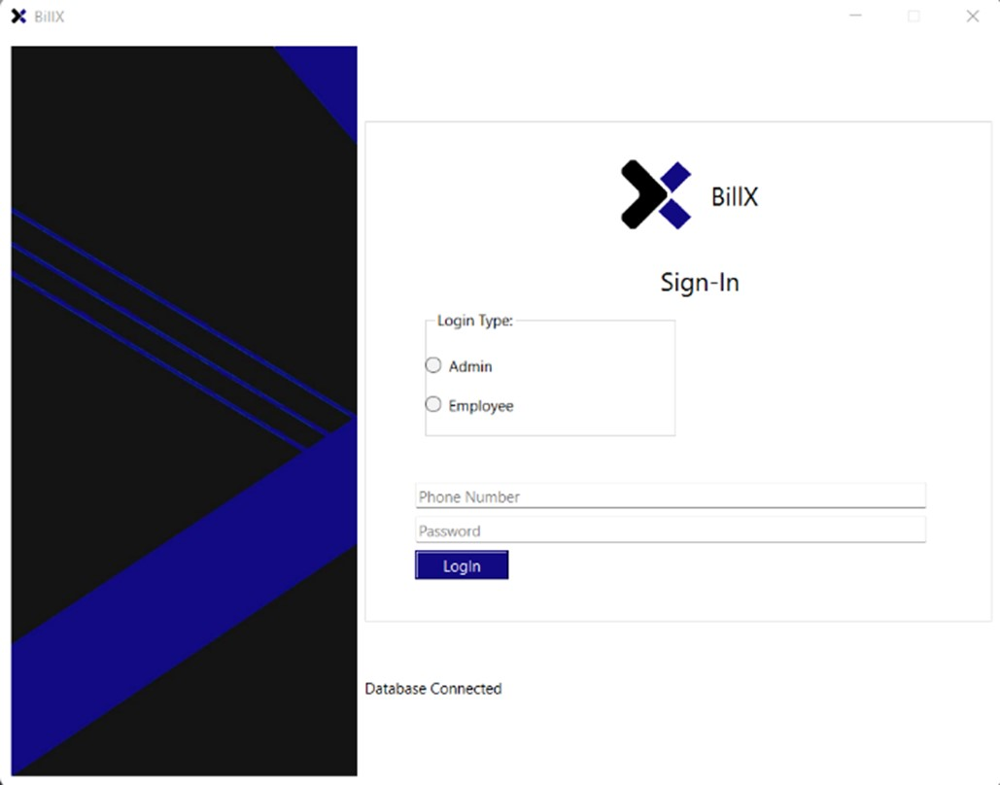

# BillX: Billing System

 

---

## 📌 Project Overview
BillX is a supermarket billing system designed to help small businesses and retail stores efficiently manage billing, inventory, and membership services. This desktop application, built using **C++**, **Qt**, and **SQLite**, simplifies transaction processes and enhances business operations.

---

## 🚀 Features
- **User Authentication**: Supports Admin and Employee login.
- **Billing System**: Generates digital bills and applies membership discounts.
- **Inventory Management**: Add, remove, and update products in stock.
- **Membership Services**: Register members for discounts and maintain records.
- **User Dashboard**: Different interfaces for Admin and Employees.

---

## 📷 Screenshots

| Feature            | Screenshot |
|-------------------|------------|
| **Login Screen**  |  |
| **Employee Register**  |  |
| **Member Register**  |  |
| **Employee Dashboard** |  |
| **Admin Dashboard** |  |
| **Create Bill**   |  |
| **Inventory Management** |  |
| **View Account**  |  |

---


## 🛠️ Technologies Used
- **Programming Language**: C++
- **Framework**: Qt
- **Database**: SQLite
- **Operating System**: Windows 10 or higher

---


## Installation 🛠️

1. **Clone the repository:**
   ```bash
   git clone https://github.com/yourusername/billx.git

2. **Navigate to the project directory:**
   ```bash
   cd billX

3. **Install Qt Framework** 
    (Ensure Qt is installed on your system).
   

4. **Open the project in Qt Creator** and configure the build settings.
   
5. **Run the project** inside Qt Creator.
   
---

## 🔥 Future Enhancements
- Generate **physical bills** along with digital receipts.
- Implement **dynamic membership discounts** to maximize profits.
- Enable **online member registration** instead of in-store only.

---

## 🤝 This project is made by:
- **Shashwat Khadka**
- **Shubin Pokhrel**
- **Siddhartha Lal Pradhan**
- **Binaya Raj Thapa**

---

## Contributing 🤝
Contributions are welcome! If you have any suggestions, bug reports, or feature requests, please open an issue or submit a pull request.

---
